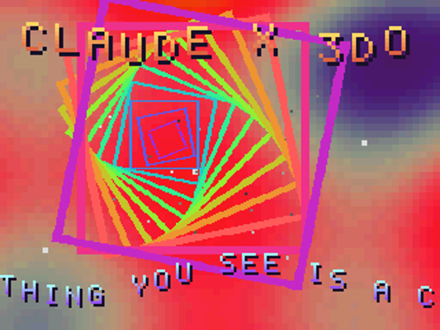
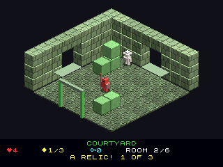
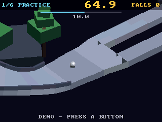

# 3do-dev — a modern dev kit for the 3DO, with a scriptable, debuggable emulator

Write software for the **3DO Interactive Multiplayer** (1993) on a modern Mac
or Linux machine. One command fetches the original-style toolchain, builds a
patched emulator with a GDB server and a remote-control API, and runs the
tests. The result is a fast **edit → build → boot → observe → test → debug**
loop that people, scripts and AI agents (Claude Code via MCP) can all drive.



> The demo above (`projects/demo`) was written, built, tested and debugged
> entirely through this toolchain: plasma, starfield, rotating cel vortex,
> bouncing title and sine scroller, all at 60 fps on an emulated 12.5 MHz ARM60.

---

## Contents

- [Cheatsheet](docs/cheatsheet.md) (one page: start, keys, commands)
- [One-line install](#one-line-install)
- [Manual install](#manual-install)
- [First steps](#first-steps)
- [The games and the arcade](#the-games-and-the-arcade)
- [How it works (overview)](#how-it-works-overview)
- [Everyday commands](#everyday-commands)
- [Remote control and debugging](#remote-control-and-debugging)
- [DevBench: web UI, REST API, OS introspection](#devbench-web-ui-rest-api-os-introspection)
- [Working with Claude Code](#working-with-claude-code)
- [Writing 3DO programs](#writing-3do-programs)
- [Repository layout](#repository-layout)
- [Documentation index](#documentation-index)
- [Troubleshooting](#troubleshooting)
- [Licensing and credits](#licensing-and-credits)

---

## One-line install

```sh
curl -fsSL https://raw.githubusercontent.com/geekychris/3do-dev/main/scripts/install.sh | bash
```

This checks prerequisites, clones the repo to `~/3do-dev`, runs `./setup.sh`
(toolchain, emulator, BIOS, Python env, full test suite, about 1–5 minutes)
and opens the demo in a window. Re-run it any time to update.

To have it install missing prerequisites too (Homebrew/apt/dnf/pacman; asks
for your password where needed):

```sh
curl -fsSL https://raw.githubusercontent.com/geekychris/3do-dev/main/scripts/install.sh | TDO_DEV_AUTO_INSTALL=1 bash
```

Knobs: `TDO_DEV_SRC` (install dir), `TDO_DEV_REF` (branch/tag), `TDO_DEV_QUICK=1`
(skip tests), `TDO_DEV_NO_BIOS=1` (bring your own ROM), `TDO_DEV_START=0`
(don't open the demo). See the header of [`scripts/install.sh`](scripts/install.sh).

## Manual install

**Prerequisites**

| | macOS | Debian / Ubuntu |
|---|---|---|
| git, make, C compiler | `xcode-select --install` | `sudo apt install git build-essential curl` |
| Docker (any engine) | Docker Desktop, Rancher Desktop, OrbStack, or colima | `sudo apt install docker.io` and add yourself to the `docker` group |
| Python ≥ 3.10 (or [uv](https://docs.astral.sh/uv/)) | `brew install python@3.12` or `brew install uv` | `sudo apt install python3 python3-venv` |
| gdb (optional, for source debugging) | `brew install gdb` | `sudo apt install gdb-multiarch` |

Windows: use WSL2 (Ubuntu) and follow the Linux column.

```sh
git clone https://github.com/geekychris/3do-dev.git && cd 3do-dev
./setup.sh             # idempotent; --quick skips tests, --no-bios skips the ROM download
./3do doctor           # verifies every piece and tells you how to fix anything broken
./3do run demo         # play the demo
```

Detailed, per-platform walkthrough: [docs/getting-started.md](docs/getting-started.md).

## First steps

```sh
./3do run demo                 # window: arrows, Z/X/C = A/B/C, Enter = P, Esc or Backspace = X
./3do new mygame               # copy the template into projects/mygame
$EDITOR projects/mygame/src/main.c
./3do run mygame               # rebuilds, boots, opens a window
./3do test mygame              # headless smoke test (projects/mygame/test.py)
./3do gdb mygame               # step through it in gdb
```

Then read [docs/writing-programs.md](docs/writing-programs.md), a tutorial
that walks through the template and the demo (display, cels, input, fixed
point, logging and tests).

## The games and the arcade

Eighteen Amiga games ported with the `sdk/amiga` compatibility layer, plus
three Unity games rebuilt for the 3DO's cel engine (Planet Chomp, Spectral
Keep and Rolling Steel), each on its own disc and all of them on the arcade disc behind a menu
(`./3do build arcade && ./3do run arcade`; X in a game returns to the menu).





Every game with screenshots, controls and measured speed:
**[docs/games.md](docs/games.md)**. Porting guide: [sdk/amiga/README.md](sdk/amiga/README.md).

## How it works (overview)

```
  your C code ──▶ bin/3do-make ──docker──▶ Norcroft ARM C (1990s ARM SDT) ──▶ AIF + ELF(DWARF)
                                           3dt packs + RSA-signs ──▶ build/<name>.iso
                                                                          │
  ┌───────────────────────── session process (tdo) ──────────────────────▼──────┐
  │  Python libretro host  ──ctypes──▶  Opera emulator core (native C, patched)  │
  │   ├─ control port  (JSON)   ◀── ./3do ctl, scripts, MCP server (Claude)     │
  │   ├─ GDB server    (RSP)    ◀── gdb / ./3do gdb                              │
  │   ├─ window        (pygame) ◀── you: keyboard, gamepad, audio               │
  │   └─ introspection: debug console, symbols, OS task list, memory, SWIs      │
  └──────────────────────────────────────────────────────────────────────────────┘
```

1. **Toolchain.** [trapexit/3do-devkit](https://github.com/trapexit/3do-devkit)
   provides the Norcroft ARM C/C++ compilers from ARM SDT 2.51, the Portfolio 2.5
   SDK headers and libraries, and tools to build signed disc images. They are
   x86 Linux binaries, so `bin/3do-make` runs them in a small Docker image (with
   QEMU emulation on Apple Silicon; builds still take about 2 s). Every build
   produces a bootable, signed ISO plus an ELF with DWARF debug info.
2. **Emulator.** [libretro Opera](https://github.com/libretro/opera-libretro),
   the maintained 3DO emulator, compiled natively with a ~50-line patch that adds
   hooks for the debug console, breakpoints, watchpoints, single-step, system-call
   tracing and memory access. Stopping the CPU never disturbs emulated timing:
   an interrupted frame resumes exactly where it stopped.
3. **Sessions.** The `tdo` Python package loads the emulator core in-process (as
   a libretro frontend) and wraps it in a **session**: a control port, a GDB
   server, an optional window, and OS introspection (it reads the 3DO kernel's
   task lists straight out of emulated RAM). Sessions are separate processes,
   so many tools can drive one emulator at once.
4. **Agents.** An MCP server exposes all of this to Claude Code. Claude can
   build, boot, press buttons, look at the screen, read logs, set breakpoints,
   run gdb, and reboot things on its own.

Full explanation, including why each piece exists and how the clever bits
work: **[docs/how-it-works.md](docs/how-it-works.md)**.

## Everyday commands

```sh
./3do setup | doctor              # install / diagnose
./3do new <name>                  # new project from sdk/template
./3do build <project>             # -> projects/<p>/build/<p>.iso (+ .elf, .sym)
./3do run <project>               # window + control :7330 + gdb :2330
./3do serve <project>             # headless session (paused) for automation
./3do log <project> --frames 600  # boot headless, print the 3DO debug console
./3do shot <project> -o s.png --until "ready" --press A@400
./3do test <project>              # project test (test.py or on-target TDO:DONE)
./3do selftest                    # build + test everything, plus the remote-control suite
./3do ctl <command> key=value     # remote-control the newest session (./3do ctl help)
./3do gdb <project> [--attach]    # gdb with symbols and sources, connected
./3do sessions                    # running sessions
./3do devbench --open             # web UI + REST API + OS inspector on :3330
```

**Window keys:** arrows = D-pad · **Z/X/C** = A/B/C · **Enter** = P (play/pause) ·
**Esc / Backspace** = X (stop: games return to the arcade menu) · **Q/W** = L/R · F1 screenshot · F2 pause/run ·
F3 frame-advance · F5/F9 save/load state · F8 reset · F12 halt/continue CPU ·
Tab fast-forward · Ctrl+Q / Cmd+Q (or close the window) quits. Game controllers work too.

## Remote control and debugging

Every session takes commands over a local JSON socket. `./3do run demo`
listens on **127.0.0.1:7330** (control) and **:2330** (gdb):

```sh
./3do ctl press buttons=A                # inject input (hold, sequence, analog, mouse, lightgun too)
./3do ctl screenshot path=shot.png       # or record_gif path=run.gif frames=120
./3do ctl ps                             # 3DO OS task list: state, priority, signals, CPU time
./3do ctl break addr=update_plasma       # halting breakpoint by symbol
./3do ctl regs ; ./3do ctl disasm count=8
./3do ctl watch addr=s_palette           # stop when a global changes
./3do ctl continue
./3do ctl read_u32 addr=s_speed ; ./3do ctl write_u32 addr=s_speed value=5
./3do ctl reboot iso=projects/hello/build/hello.iso   # power-cycle with another disc
./3do ctl save_state name=before-boss ; ./3do ctl load_state name=before-boss
./3do ctl help                           # all ~70 commands
./3do gdb demo --attach                  # source-level gdb on the same, live session
```

```
(gdb) break main.c:396
(gdb) continue
Breakpoint 1, update_text (t_=1284) at src/main.c:396
(gdb) bt
#0  update_text (t_=1284) at src/main.c:396
#1  0x00072068 in main () at src/main.c:489
(gdb) p *s_squares[0]
$1 = {ccb_Flags = 1063666704, ccb_NextPtr = 0x84670, ccb_SourcePtr = 0x88a44, ...}
(gdb) monitor ps
```

The protocol is plain JSON lines (`{"cmd":"press","args":{"buttons":"A"}}`),
so any language or agent harness can drive the emulator. Reference:
[docs/emulator-harness.md](docs/emulator-harness.md).

## DevBench: web UI, REST API, OS introspection

```sh
./3do devbench --open        # http://127.0.0.1:3330/
```


A browser workbench and plain REST API for everything above, plus a
**Portfolio OS inspector**. It reads the kernel's item table straight out of
emulated RAM, so it needs no code on the 3DO and works even when the program
has crashed:

- **Tasks** (state, priority, signals, the item each is blocked on, stacks,
  CPU time, memory), **message ports** and queued messages, **semaphores**,
  **devices / drivers / in-flight I/O requests**, **folios**, **screens and
  bitmaps**, audio and filesystem items, and any **item** in raw detail
- a **memory map** of every DRAM/VRAM page by owning task, and **snapshots +
  diff** to find leaked items and see where CPU time went
- **system-call snoop** (every SWI, by name), a sampling **profiler**, crash capture
- live screen with an on-screen pad, breakpoints from the disassembly,
  registers, a memory editor, the debug console and an API explorer

The REST API (`POST /api/cmd/os_tasks`, `GET /api/screen.png`, `GET /api/events`
for Server-Sent Events, `/api/openapi.json`) and the MCP server over HTTP
(`/mcp`) are served from the same port. **Annotated walkthrough with
screenshots of every view:** [docs/devbench.md](docs/devbench.md#walkthrough).

## Working with Claude Code

Open the repo with `claude`. [`.mcp.json`](.mcp.json) registers the **3do** MCP
server (approve it on first use), and [`CLAUDE.md`](CLAUDE.md) teaches Claude
the workflow and the 3DO gotchas. Ask for things like:

- *"Make a breakout clone in projects/breakout and test it."* Claude uses
  `build`, `emu_boot`, `emu_press`, `emu_look` (screenshot + log) and `run_tests`.
- *"Why does the ball go through the paddle? Debug it."* Claude uses `emu_break`,
  `emu_watch`, `emu_regs`, `emu_disasm` and `gdb_run(["bt", "info locals"])`.
- *"Take over the window I'm watching."* Claude uses `emu_attach`.

~50 tools in all: sessions (boot/attach/restart/reset/reboot), run control,
input for every 3DO peripheral, screenshots/GIFs, logs, OS task list, symbols,
breakpoints/watchpoints/tracepoints, memory, snapshots, gdb, and OS introspection
(tasks, items, ports, semaphores, I/O, memory map, snapshot diffs, named syscalls, profiler).

## Writing 3DO programs

```c
#include "tdo.h"   /* tdo_log(): printf to the debug console; tdo_check(): on-target tests */

tdo_log("mygame: level=%d score=%d lives=%d\n", level, score, lives);
```

- Programs are C89 for Norcroft ARM C: declarations at the top of blocks, no FPU
  (use 16.16 fixed point and the operamath folio), big-endian.
- Graphics are **cels**: hardware-scaled, rotated and blended sprites, drawn
  with one `DrawCels()` call per frame. See `projects/demo`.
- Everything you `kprintf`/`printf`/`tdo_log` appears in `./3do log`, the
  window's terminal, `./3do ctl log` and Claude's `emu_log`.
- **Gotcha:** `kprintf` garbles every argument after the third, so use `tdo_log`.
- Assets: `assets/foo.png` becomes `cels/foo.cel` on the disc; `takeme/` is
  copied to the disc root; `banner.png` becomes the boot splash.
- Tests: `tdo_check(...)` + `tdo_test_done()` on the console, or a host-side
  `test.py` that drives input and inspects frames.

Tutorial: [docs/writing-programs.md](docs/writing-programs.md). Hard-won
facts about the hardware and OS: [docs/3do-notes.md](docs/3do-notes.md).
Original SDK reference: `third_party/3do-devkit/docs/3dosdk/` (after setup)
and https://3dodev.com.

## Repository layout

```
3do                    single entry point (./3do help)
setup.sh               full setup (idempotent)
scripts/               install.sh (one-liner), fetch-devkit, build-emulator, fetch-bios,
                       build-toolchain-image, setup-python, doctor
bin/3do-make           runs make with the devkit toolchain (Docker or native)
docker/Dockerfile      runtime for the devkit's x86 Linux tools
sdk/                   project.mk (build rules), tdo.h/tdo.c (logging + tests), template/
emulator/              Opera patch + harness extension (C)
tools/tdo/             Python: emulator host, session server, gdb stub, MCP server, CLI, tests
tools/probe/           3DO program that prints OS structure offsets (used by `ps`)
projects/              demo, hello, unittest – and yours
docs/                  guides (see below)
third_party/ bios/ .venv/ build/   created by setup, not committed
```

## Documentation index

| Document | What's in it |
|---|---|
| [docs/getting-started.md](docs/getting-started.md) | Installing on macOS / Linux / WSL2, first run, verifying, updating, uninstalling |
| [docs/how-it-works.md](docs/how-it-works.md) | The full story: toolchain, emulator, sessions, debugger, symbols, OS introspection, MCP |
| [docs/writing-programs.md](docs/writing-programs.md) | Tutorial: display, cels, input, fixed point, logging, assets, testing, debugging |
| [docs/emulator-harness.md](docs/emulator-harness.md) | Reference: sessions, every control command, gdb, C API, memory map |
| [docs/cheatsheet.md](docs/cheatsheet.md) | One page: start the arcade, keys, everyday commands, DevBench, troubleshooting |
| [docs/games.md](docs/games.md) | The arcade and all 21 games: screenshots, controls, speed |
| [docs/devbench.md](docs/devbench.md) | Web UI, REST API, SSE events, OS introspection (tasks, items, memory map, snapshots) |
| [docs/3do-notes.md](docs/3do-notes.md) | Verified facts and gotchas about the 3DO hardware, OS and compiler |
| [docs/architecture.md](docs/architecture.md) | Component diagram and design decisions |
| [docs/troubleshooting.md](docs/troubleshooting.md) | Problems and fixes |
| [CLAUDE.md](CLAUDE.md) | Instructions Claude Code reads when working in this repo |

## Troubleshooting

Start with `./3do doctor`. Most common issues:

- **Build fails with "Exec format error" / compilers don't execute.** Your
  Docker VM restarted and lost its x86 emulation. Run `./scripts/build-toolchain-image.sh`.
- **Port 7330 in use.** Use `./3do run demo --port 7331 --gdb-port 2331`.
- **Emulator process killed (exit 137) on macOS after rebuilding the core.**
  Restart any emulator windows that were already running.

More: [docs/troubleshooting.md](docs/troubleshooting.md).

## Licensing and credits

The code in this repository (scripts, `tools/`, `sdk/`, `emulator/ext/`,
projects, docs) is MIT licensed; see [LICENSE](LICENSE). It downloads and
builds third-party components that keep their own licenses:

- **[3do-devkit](https://github.com/trapexit/3do-devkit)** by trapexit: the
  devkit, Norcroft compilers (ARM SDT, provided to trapexit by ARM), and 3DO SDK
  headers/libraries. Fetched at setup, not redistributed here.
- **[Opera](https://github.com/libretro/opera-libretro)** (libretro), descended
  from FreeDO/4DO, under its own license (LGPL with FreeDO's non-commercial
  terms). `emulator/patches/` contains a patch against it; the built core is not
  redistributed.
- **3DO BIOS ROMs** are copyrighted firmware, downloaded from
  [3dodev.com](https://3dodev.com/software/roms) at setup time and never
  committed. Use your own dumps if you prefer (see `bios/README.md`).

Thanks to trapexit, the FreeDO/4DO/Opera authors, Optimus, the
[3dodev.com](https://3dodev.com) community, and The 3DO Company's original SDK
team.
