# DevBench: web UI, REST API and OS introspection

```sh
./3do devbench --open          # http://127.0.0.1:3330/
```

DevBench is one local server that holds everything you can do to a running 3DO:

- a **web UI** (Dashboard, Screen, OS, Debug, Memory, Console, API)
- a **REST API**: every session command plus projects, sessions, screen PNG and an OpenAPI spec
- a **live event stream** (Server-Sent Events) carrying status, the debug console, CPU stop/run and crashes
- the **MCP server** over streamable HTTP at `/mcp`, for agents that prefer HTTP to stdio

It has no build step and no extra services. It's a Starlette app inside the `tdo` venv, and the
UI is a single HTML file (`tools/tdo/src/tdo/web/index.html`). It talks to emulator sessions over
their normal control sockets, so sessions started by `./3do run`, `./3do serve`, MCP or the UI
itself all show up, and several clients can drive the same session.

It binds to 127.0.0.1 by default. `--host 0.0.0.0` exposes it on your network. **There is
no authentication**, so only do that on a network you trust.

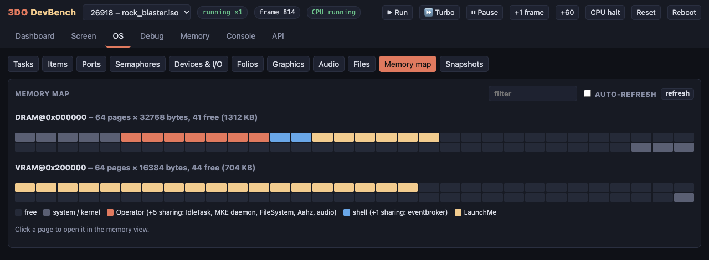

## Walkthrough

These screenshots were taken from a real session: the Nova Defense port for
most views and the arcade menu disc for snapshots. The numbered red markers
are explained under each picture. `docs/tools/capture_devbench.py`
regenerates them.

### Starting up

```sh
./3do devbench --open            # or: .venv/bin/tdo devbench --port 3330
```

DevBench runs in the background of your terminal. It doesn't start an
emulator by itself: you pick a disc on the Dashboard, or it finds sessions
that are already running (`./3do run demo`, `./3do serve`, MCP's
`emu_boot`). Stopping DevBench doesn't stop those sessions.

### 1. Dashboard

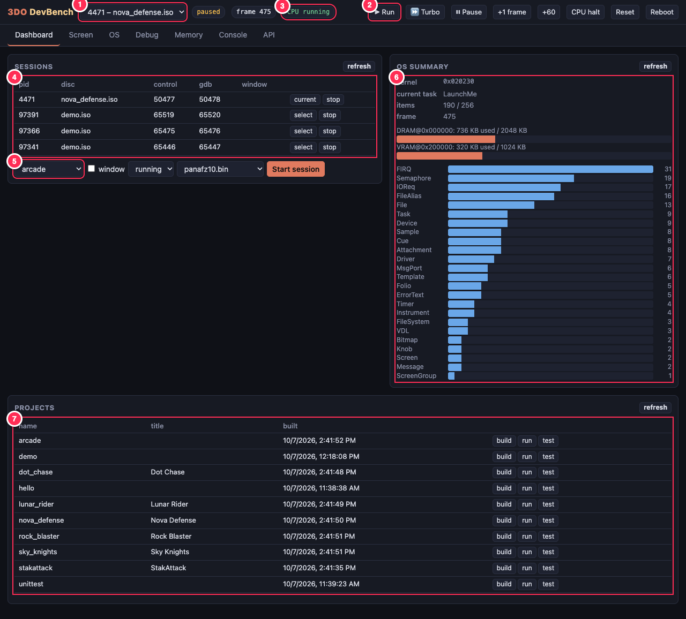

1. **Session picker.** Every running emulator session (DevBench's own,
   `./3do run` windows, headless agent sessions). Every tab shows the
   session chosen here. Next to it: run mode, frame counter.
2. **Run controls** for the selected session. **Run** plays in real time,
   **Turbo** as fast as possible, **Pause** stops time, **+1 frame / +60**
   single-step. **CPU halt** freezes the ARM CPU like a debugger (the
   display keeps showing the last frame). **Reset** reboots the disc,
   **Reboot** power-cycles.
3. **CPU state.** `CPU running` or, after a breakpoint or halt,
   `CPU HALTED` in red.
4. **Sessions table.** pid, disc, its control and gdb ports, whether it
   has a desktop window. *select* makes it current, *stop* ends it.
5. **Start a session.** Pick a disc, optionally a desktop window, the mode
   (*running*, or *paused* for scripted stepping) and the BIOS, then
   **Start session**.
6. **OS summary.** Read from the 3DO's kernel: where KernelBase is, the
   current task, live items against the item table size, DRAM/VRAM in use,
   and a bar per item type.
7. **Projects.** Every project in `projects/`, with **build** (shows
   compiler errors), **run** (starts a session on its ISO) and **test**
   (runs its `test.py`).

### 2. Screen and input

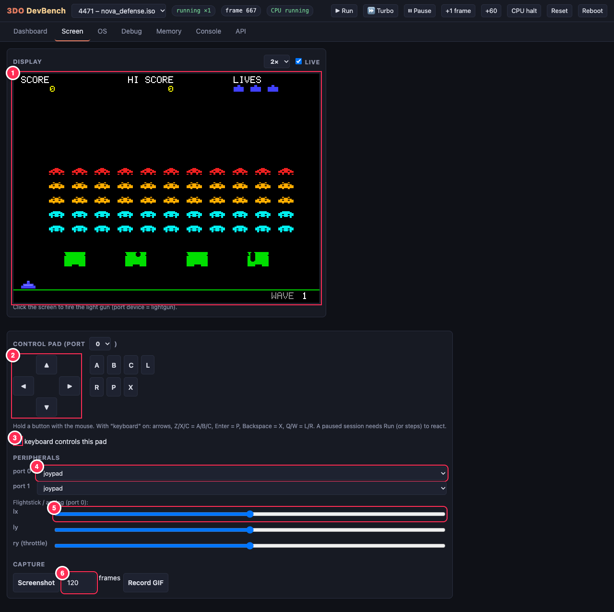

1. **Live display**, refreshed several times a second while running, at 1×
   to 3×. With a light gun on a port, clicking the picture fires it there.
2. **Control pad.** Hold buttons with the mouse. Buttons stay down while
   pressed, so you can hold LEFT and tap A.
3. **Keyboard control.** With this ticked, arrows = D-pad, Z/X/C = A/B/C,
   Enter = P, Backspace = X, Q/W = L/R.
4. **Peripherals per port.** joypad, flightstick, mouse, light guns,
   Orbatak trackball, none.
5. **Analog axes** for the flightstick (stick X/Y, throttle).
6. **Capture.** Screenshot (saved under `build/devbench/`, link shown) or
   record an animated GIF of the next N frames.

### 3. OS: tasks

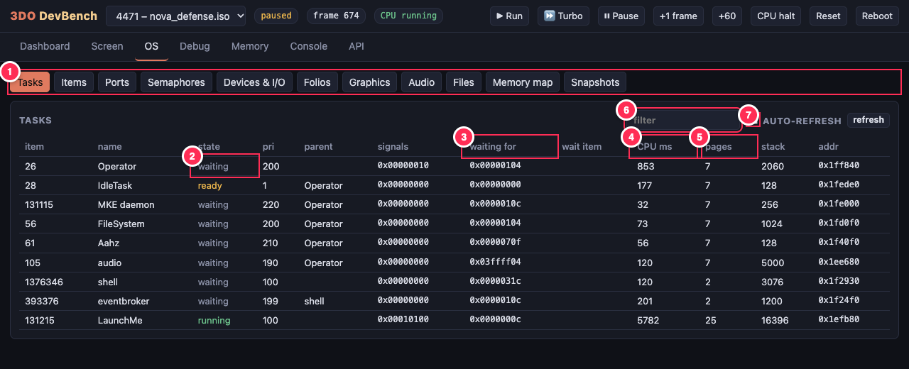

1. **OS views.** Each one walks a different Portfolio structure.
2. **State.** `running` (green) is the task on the CPU now, `ready` is
   waiting for the CPU, `waiting` is blocked on signals. Here the game
   (`LaunchMe`) runs while system tasks wait.
3. **Signals.** `signals` holds the bits received, `waiting for` the bits
   the task is blocked on, and `wait item` the item it waits on, if any.
   A task stuck forever shows up here.
4. **CPU ms.** Total CPU time per task. Compare two snapshots (view 10) to
   see who used the CPU over an interval.
5. **Pages.** Memory pages the task owns (32 KB DRAM / 16 KB VRAM each).
   Tasks that share a memory list show the same number.
6. **Filter** any OS table by text (a name, a type, an address).
7. **Auto-refresh** reloads the view every 2 seconds while the game runs.

Click any row for its item detail (view 5).

### 4. OS: memory map

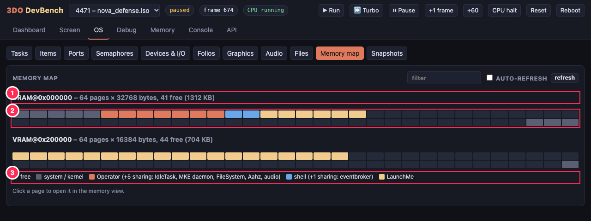

1. **Region.** DRAM (2 MB in 32 KB pages) and VRAM (1 MB in 16 KB pages),
   with the free total. Data comes from the kernel's free-page bitmaps.
2. **One square per page**, coloured by owner. Here: the kernel at the
   bottom of DRAM, the system tasks' shared pool, the shell, the game's
   code and data from 0x70000, and the game's two framebuffers at the
   start of VRAM. Hover for the address and owner; click to hex-dump the
   page.
3. **Legend.** *system / kernel* pages are in use but owned by no task's
   memory list.

### 5. OS: devices, I/O and item detail

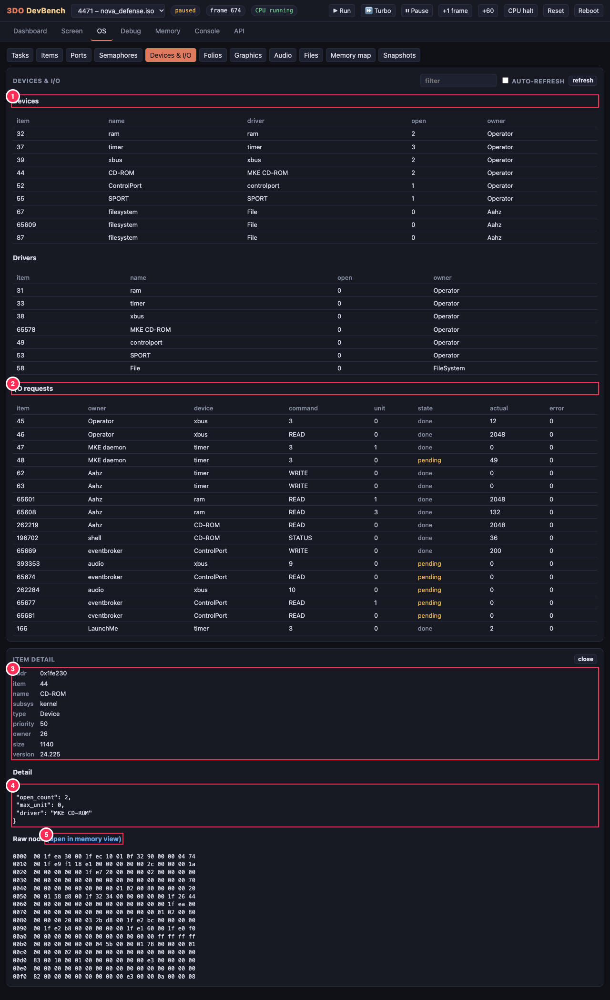

1. **Devices** with the driver behind each and how many times it's open.
   Below that, the **drivers**.
2. **I/O requests.** Every IOReq: owner, device, command (READ, WRITE,
   STATUS or a device-specific number), unit, bytes transferred, error,
   and **pending** (in flight, orange) or done. Pending CD-ROM reads, for
   example, show up here.
3. **Item detail** (click any row). Common node fields: address, item
   number, name, subsystem, type, priority, owner, size, version.
4. **Type-specific fields.** Here the CD-ROM device's open count and
   driver. A message port shows its queued messages, a semaphore its
   owner and waiters, a screen its bitmaps.
5. **Raw node** bytes, with a link that opens the item's memory in the
   Memory tab.

### 6. Debug

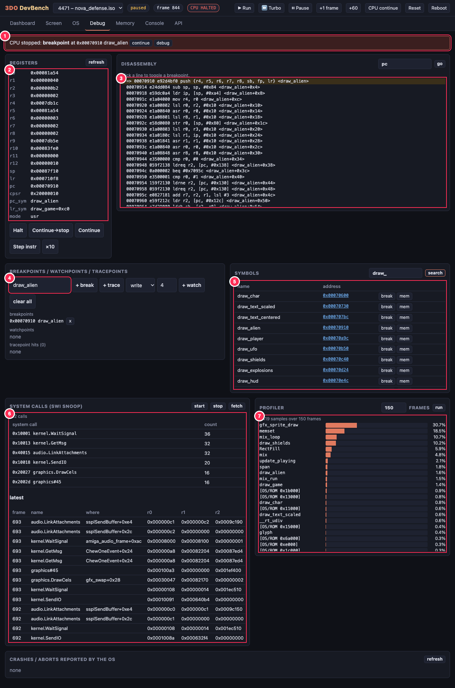

1. **Stop banner.** Appears whenever the CPU stops (breakpoint,
   watchpoint, halt): why, and where (address and symbol). The buttons
   continue or jump here.
2. **Registers** r0-r15 and CPSR, with `pc` and `lr` symbolized
   (`draw_alien`, called from `draw_game+0xc0`).
3. **Disassembly** around the PC (or any address or symbol), annotated
   with symbol offsets. `=>` marks the PC, and clicking a line toggles a
   breakpoint (red dot).
4. **Breakpoints, watchpoints and tracepoints.** Type a symbol or address.
   *+ break* stops the CPU there, *+ trace* logs every call with r0-r3 and
   the caller without stopping, and *+ watch* stops when memory is
   written, read or accessed. Lists and hit logs appear below.
5. **Symbols.** Search the program's symbols with their runtime addresses
   (after load relocation). Each has *break* and *mem* shortcuts.
6. **System calls (SWI snoop).** *start* records every system call the
   game and the OS make, named from the SDK headers (`kernel.WaitSignal`,
   `graphics.DrawCels`, `audio.LinkAttachments`...), with counts and the
   latest calls (frame, caller, arguments). *fetch* reads the trace.
7. **Profiler.** Runs N frames while sampling the PC, then shows the share
   of CPU per function. OS/ROM and idle time are grouped. Here it shows
   Nova Defense spending its time on sprites and clearing the screen.

The CPU stays halted until you **continue**. Source-level debugging of the
same session is available with `./3do gdb <project> --attach` (gdb port on
the Dashboard).

### 7. Memory

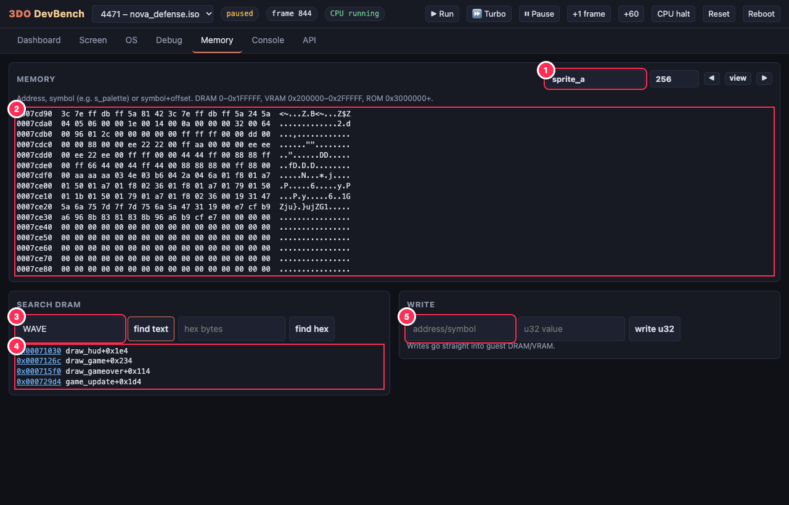

1. **Address** as a number, symbol (`sprite_a`) or `symbol+offset`, plus
   a length. ◀ ▶ page through.
2. **Hex and ASCII dump.** Here the alien sprite bitmaps from Nova
   Defense's data.
3. **Search** DRAM for text or hex bytes.
4. **Hits** with the symbol each falls in (here the "WAVE" strings inside
   the HUD code). Click to dump.
5. **Write** a 32-bit word into guest memory, e.g. to change a variable
   while the game runs.

### 8. Console

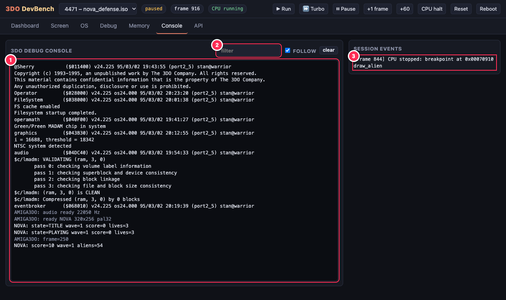

1. **The 3DO debug console**, live. Kernel boot messages, then everything
   the program prints with `printf`/`kprintf`/`tdo_log()`. Ports log their
   state changes (`NOVA: state=PLAYING ...`). Lines from the layer
   (`AMIGA3DO:`) are dimmed; errors and aborts are red.
2. **Filter** the console text. *follow* keeps it scrolled to the end.
3. **Session events.** Breakpoints hit, resets, reboots, crashes.

### 9. API explorer

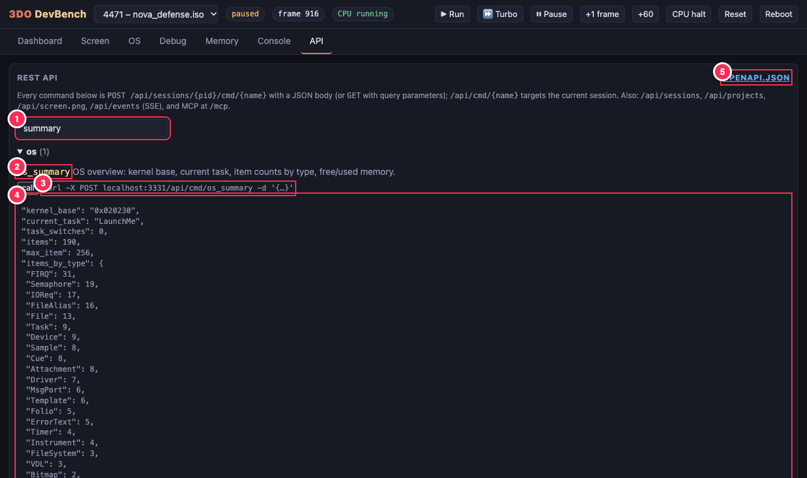

1. **Filter** the ~70 commands.
2. **Every command** with its description and parameters (`*` = required,
   `= value` = default).
3. **The curl line** for calling it yourself.
4. **Result** of *call*, as JSON (screenshots show as images).
5. **OpenAPI spec** for the whole API, to import into Postman or Insomnia
   or generate a client from.

### 10. OS snapshots: what did that do?

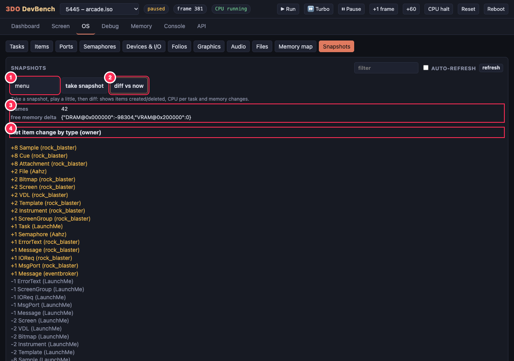

The story here: in the arcade menu, take a snapshot named `menu`, press A
to launch Rock Blaster, then diff.

1. **Snapshot name** (keep several, e.g. `menu`, `level2`).
2. **diff vs now** compares that snapshot with the current state.
3. **Frames** between them, and the change in **free memory** per region
   (Rock Blaster took 96 KB of DRAM).
4. **Net item change by type and owner.** The menu (`LaunchMe`) released
   its screens, VDLs, audio instruments and samples (-) before launching.
   The game started a new task, `rock_blaster` (+1 Task), created its own
   screens, samples and cues (+), and the filesystem opened its file.
   Anything that keeps growing with nothing to balance it, especially
   after a game has exited, is a leak. `projects/arcade/test.py` checks
   exactly this.
5. **Items created / deleted** in full (further down the page), then CPU
   time per task over the interval.

### Troubleshooting

- **"The 3DO OS isn't running yet (frame 0)"** in the OS views: the
  session is paused or still booting. Press **Run** (or *Run it* in the
  message) and wait a couple of seconds. Paused sessions only advance when
  stepped; agents use them for reproducible runs.
- **No sessions in the picker:** start one on the Dashboard, or with
  `./3do run <project>` / `./3do serve <project>`.
- **Port 3330 in use:** `./3do devbench --port 3340`.
- **The picture is frozen:** the session is paused, or the CPU is halted
  (red `CPU HALTED`). Press Run or CPU continue.

## OS introspection

Portfolio keeps every OS object (task, message port, semaphore, device, I/O request,
screen, bitmap, sample, file...) as an **item** in a table hanging off `KernelBase`.
`tdo.osinspect` reads that table and the structures it points to straight out of emulated
RAM. Nothing runs on the 3DO, so introspection works on any program, including one that's
crashed or halted at a breakpoint, and it costs the guest no CPU time.

| View | What you see |
|---|---|
| **Summary** | kernel base, current task, item counts by type, DRAM/VRAM used vs free |
| **Tasks** | state (running/ready/waiting), priority, parent thread, signal bits received / waited for, the item it's blocked on, user + supervisor stacks, CPU ms, memory pages owned |
| **Items** | every live item: number, type, subsystem, name, owning task, address, size |
| **Ports** | message ports, their signal and queued messages (reply port, data, size) |
| **Semaphores** | locked?, by whom, nest count, waiters |
| **Devices & I/O** | devices with their driver and open count, drivers, and every IOReq: device, command, unit, offset, bytes transferred, error, done/pending |
| **Folios** | loaded folios (the OS's shared libraries) with open counts and SWI table sizes |
| **Graphics** | screen groups, screens (with their bitmaps, framebuffer addresses and sizes), bitmaps, VDLs |
| **Audio / Files** | audio folio items (templates, instruments, knobs, samples, attachments); filesystems, open files, aliases |
| **Memory map** | each DRAM page (32 KB) and VRAM page (16 KB), coloured by the task (or group of tasks sharing a memory list) that owns it. Click a page to hex-dump it |
| **Snapshots** | take a snapshot, play, diff: items created/deleted (resource leaks), CPU time per task, page ownership changes, free memory delta |
| **Item detail** | click any row: type-specific fields plus the raw node bytes, with a jump to the memory view |

How the walk works, and the structure offsets it relies on (which `tools/probe` measured
on target), are in [how-it-works.md](how-it-works.md#os-introspection) and in the comments
at the top of `tools/tdo/src/tdo/osinspect.py`.

## Debugging from the browser

- **Registers** (symbolized pc/lr), **disassembly** with symbols. Click a line to toggle
  a breakpoint.
- **Breakpoints, watchpoints** (read/write/access), **tracepoints** (log r0-r3 and the
  caller without stopping).
- **Halt / continue / step instruction.** When the CPU stops, a banner shows where and why.
- **System calls (SWI snoop):** every `SWI` the program makes, named from the SDK headers
  (`kernel.WaitSignal`, `graphics.DrawCels`, ...), with counts, call site and arguments.
- **Profiler:** samples the PC at random points inside frames and reports the percentage
  of CPU per function, with idle and OS time bucketed separately.
- **Crashes:** aborts and exceptions the OS prints are captured with registers and log
  context, and pushed to the UI as they happen.
- **Memory:** hex view by address or symbol, search DRAM for text or bytes, write words.
- **Screen:** live view, on-screen control pad (or your keyboard), peripheral selection
  (joypad, flightstick with analog sliders, mouse, light gun: click the screen to shoot),
  screenshot and GIF capture.

## REST API

Everything is JSON. Errors use real status codes with `{"error": "..."}`:
400 for bad arguments, 404 for an unknown session or command, 409 when a command fails,
422 when a build or test fails.

| Method | Path | |
|---|---|---|
| GET | `/api/health` | liveness |
| GET | `/api/commands` | command catalogue: name, doc, params, group |
| GET | `/api/openapi.json` | OpenAPI 3 spec (import it into Postman, Insomnia, ...) |
| GET | `/api/projects` | projects and their ISOs |
| POST | `/api/projects/{name}/build` | compile; `{"exit", "output"}` |
| POST | `/api/projects/{name}/test` | run its tests |
| GET | `/api/sessions` | running sessions (and which one is current) |
| POST | `/api/sessions` | start one: `{"target": "demo", "window": false, "mode": "paused", "bios": "panafz10.bin"}` |
| POST | `/api/sessions/{pid}/select` | make it the current session |
| DELETE | `/api/sessions/{pid}` | stop it |
| GET / POST | `/api/sessions/{pid}/cmd/{command}` | run any session command, with args as query params or a JSON body |
| GET / POST | `/api/cmd/{command}` | same, on the current session |
| GET | `/api/sessions/{pid}/screen.png?scale=2`, `/api/screen.png` | current frame |
| GET | `/api/events?session={pid}` | SSE: `status` (twice a second), `log`, `stop`, `run`, `crash`, `event` |
| GET | `/api/artifact?path=build/...` | fetch a file a command wrote (screenshots, GIFs) |
| * | `/mcp` | MCP (streamable HTTP) |

The commands are the same ones `./3do ctl help` lists (~70) and are documented in
[emulator-harness.md](emulator-harness.md). The OS ones are `os_summary`,
`os_items [type=]`, `os_item item=N`, `os_tasks`, `os_ports`, `os_semaphores`,
`os_devices`, `os_folios`, `os_graphics`, `os_audio`, `os_files`,
`os_memory [per_page=]`, `os_snapshot [name=]`, `os_diff [a=] [b=]`.

```sh
B=http://127.0.0.1:3330
curl -s -X POST $B/api/sessions -d '{"target":"demo"}'                 # boot (paused)
curl -s -X POST $B/api/cmd/run_until -d '{"text":"DEMO: ready"}'
curl -s $B/api/cmd/os_tasks | jq '.tasks[] | {name, state, cpu_ms}'
curl -s -X POST $B/api/cmd/press -d '{"buttons":"A"}'
curl -s $B/api/screen.png?scale=2 -o shot.png
curl -s -X POST $B/api/cmd/os_snapshot -d '{"name":"a"}'
curl -s -X POST $B/api/cmd/step -d '{"frames":600}'
curl -s "$B/api/cmd/os_diff?a=a" | jq '.items_created'
curl -sN "$B/api/events" | grep --line-buffered '^event: log' -A1   # follow the console
```

From Python, it's plain HTTP:

```python
import requests
B = "http://127.0.0.1:3330/api"
pid = requests.post(f"{B}/sessions", json={"target": "rock_blaster"}).json()["pid"]
requests.post(f"{B}/cmd/run_until", json={"text": "AMIGA3DO: frame=250"})
print(requests.get(f"{B}/cmd/os_memory", params={"per_page": "false"}).json())
```

## MCP

The stdio server (`.mcp.json`, used by Claude Code) and DevBench's `/mcp` are the same
server. The OS tools are:

| Tool | |
|---|---|
| `os_overview` | summary |
| `os_inspect(view)` | tasks, items, ports, semaphores, devices, folios, graphics, audio, files |
| `os_item(n)` | one item in depth |
| `os_memory_map` | page ownership as text |
| `os_snapshot` / `os_diff` | what changed: leaks, CPU per task |
| `emu_syscalls` | SWI snoop: start, stop, fetch |
| `emu_profile` | where the CPU time goes |
| `emu_crashes` | OS-reported aborts |

A client connected over HTTP with no session of its own uses the newest running
session. A session you start in the UI can be handed straight to an agent.

## Compared with amiga_mcp's DevBench

This takes its layout from the Amiga DevBench (tabs, a single SSE bus, a memory-map
view, snapshot diffs, crash capture, a SnoopDos-style call log). The main difference: the
Amiga version gets its data from a daemon running on the Amiga, which talks over serial.
Here everything comes from the emulator, so:

- no guest code is needed, and nothing is perturbed (no daemon task, no extra memory)
- it works while the CPU is halted or the program has crashed
- system-call tracing sees every `SWI` from every task, not just patched library calls

The other side of this is that it doesn't work on real hardware, and app-cooperative
features (registered variables and hooks) aren't implemented. Use `tdo_log()` lines plus
`watch`/`read_u32` on globals instead.
