# The games

Ports of the Amiga games to the 3DO through the sdk/amiga compatibility
layer, and Planet Chomp, a Unity game rebuilt for the 3DO's cel engine.
Every game is its own disc (`./3do build <game>`), and the arcade
disc (`./3do build arcade`) bundles all of them behind a menu.
Screenshots are from the automated tests; regenerate this page with
`docs/tools/capture_games.py`.

## The arcade

Up/Down choose, Left/Right page, A plays. In a game, X goes back to the
menu. The bar to the right of the list shows where you are.

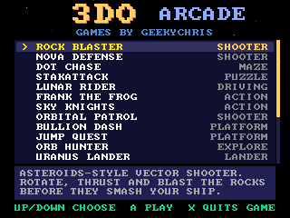 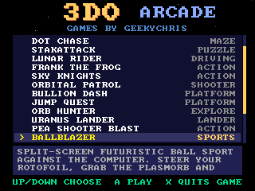

## Speed on the 3DO

Every game keeps its Amiga speed: logic runs at 50 steps per second
(the PAL frame rate), and the 3D games that draw fewer frames catch
up on logic steps (`gfx_steps()`) rather than slowing down.
Measured in the emulator by `./3do selftest`.

| Game | logic steps/s | frames drawn/s |
|---|---|---|
| [Rock Blaster](#rock-blaster) | 50 | 50 |
| [Nova Defense](#nova-defense) | 50 | 50 |
| [Dot Chase](#dot-chase) | 50 | 50 |
| [StakAttack](#stakattack) | 50 | 50 |
| [Lunar Rider](#lunar-rider) | 52 | 50 |
| [Frank the Frog](#frank-the-frog) | 50 | 50 |
| [Sky Knights](#sky-knights) | 50 | 50 |
| [Orbital Patrol](#orbital-patrol) | 50 | 46 |
| [Bullion Dash](#bullion-dash) | 50 | 50 |
| [Jump Quest](#jump-quest) | 50 | 50 |
| [Orb Hunter](#orb-hunter) | 50 | 50 |
| [Uranus Lander](#uranus-lander) | 50 | 50 |
| [Pea Shooter Blast](#pea-shooter-blast) | 50 | 50 |
| [Ballblazer](#ballblazer) | 49 | 30 |
| [Ace Pilot](#ace-pilot) | 50 | 27 |
| [Void Trader](#void-trader) | 50 | 24 |
| [RJ Birthday](#rj-birthday) | 50 | 50 |
| [Fractalus](#fractalus) | 50 | 9 |
| [Planet Chomp](#planet-chomp) | 49 | 14 |

## Games

### Rock Blaster

Asteroids-style vector shooter. Rotate, thrust and blast the rocks before they smash your ship. LEFT/RIGHT rotate, UP or B thrust, A fire.

Shooter · `projects/rock_blaster` · from the Amiga version

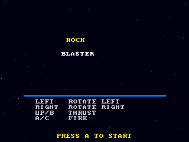 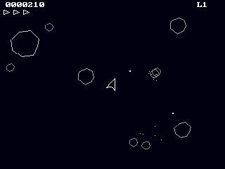

### Nova Defense

Space Invaders-style shooter. Hold back the alien swarm from behind your shields and pick off the UFO. LEFT/RIGHT move, A fire.

Shooter · `projects/nova_defense` · from the Amiga version

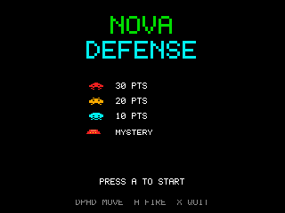 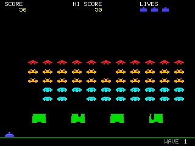

### Dot Chase

Maze chase in the style of Pac-Man. Eat every dot, grab a power pellet to turn the tables on the ghosts. D-pad steers, A starts.

Maze · `projects/dot_chase` · from the Amiga version

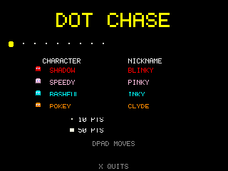 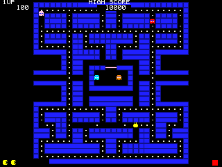

### StakAttack

Falling-block puzzle with ProTracker music. Fit the pieces together and clear lines before the stack reaches the top. LEFT/RIGHT move, A rotate, B drop, DOWN soft drop, P pause.

Puzzle · `projects/stakattack` · from the Amiga version

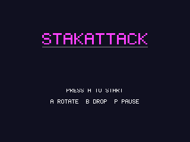 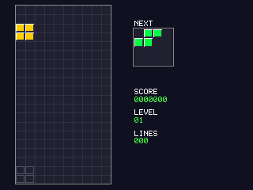

### Lunar Rider

Moon Patrol-style buggy ride. Jump the craters and rocks while shooting UFOs and meteors on the way to each checkpoint. LEFT/RIGHT speed, UP or B jump, A shoot.

Driving · `projects/lunar_rider` · from the Amiga version

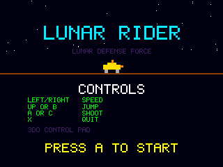 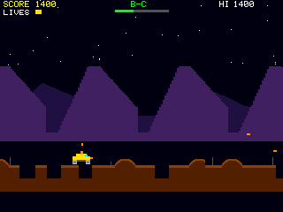

### Frank the Frog

Frogger-style crossing with generated music. Hop across the traffic and ride the logs to fill all five homes. D-pad hops, A starts.

Action · `projects/frank_the_frog` · from the Amiga version

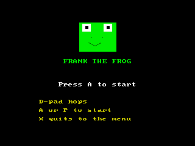 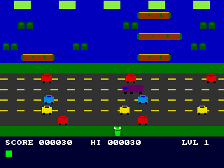

### Sky Knights

Joust-style jousting on flying mounts for one or two players. Land on enemies from above and collect the eggs. D-pad steers, A flaps. A starts one player, C two (second pad).

Action · `projects/sky_knights` · from the Amiga version

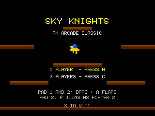 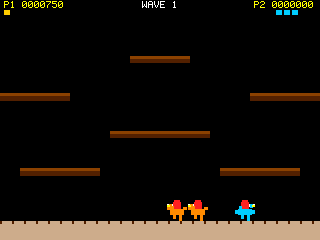

### Orbital Patrol

Defender-style side scroller with ProTracker music. Fly over the planet, shoot the invaders and protect the humans. D-pad flies, A fire, B smart bomb, C hyperspace.

Shooter · `projects/orbital_patrol` · from the Amiga version

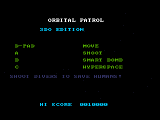 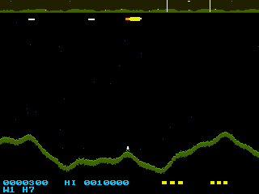

### Bullion Dash

Lode Runner-style puzzle platformer with a level editor. Collect the gold, dig traps for the guards, then climb out. A fire, B/C dig left/right. C on the title opens the editor: A put, B tile, L save, R load, P test.

Platform · `projects/bullion_dash` · from the Amiga version

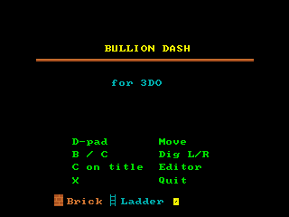 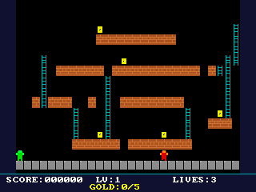

### Jump Quest

Side-scrolling platformer for one or two players taking turns. Pick RJ or Dale, jump on the enemies and reach the end of three levels. D-pad moves, A jumps.

Platform · `projects/jump_quest` · from the Amiga version

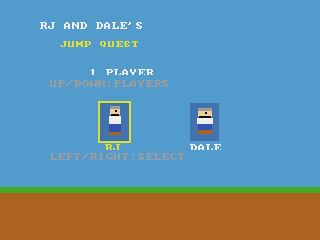 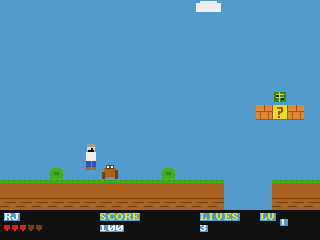

### Orb Hunter

Metroid-style exploration. Search the caverns room by room, collect power-ups to reach new areas. LEFT/RIGHT move, UP or B jump, DOWN rolls, A fires (bombs when rolled), UP + A fires a missile.

Explore · `projects/orb_hunter` · from the Amiga version

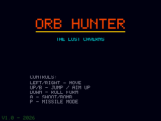 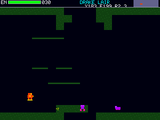

### Uranus Lander

Lunar Lander over the rings of Uranus, with ProTracker music. Rotate, thrust gently and touch down on the pads before the fuel runs out. LEFT/RIGHT rotate, A thrust.

Lander · `projects/uranus_lander` · from the Amiga version

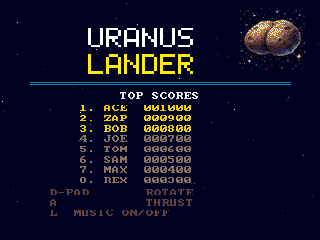 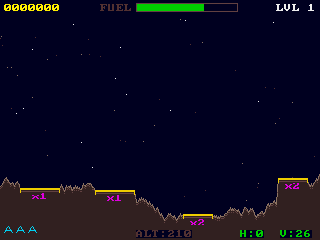

### Pea Shooter Blast

Side-scrolling tank action. Drive, jump and blast through the enemy lines to the end of each level. D-pad drives, UP or B jumps, A fires.

Action · `projects/pea_shooter_blast` · from the Amiga version

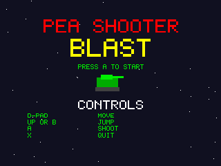 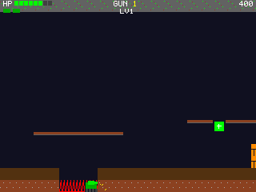

### Ballblazer

Split-screen futuristic ball sport against the computer. Steer your rotofoil, grab the plasmorb and carry it over the goal line. UP or A forward, DOWN or B reverse, LEFT/RIGHT strafe.

Sports · `projects/ballblazer` · from the Amiga version

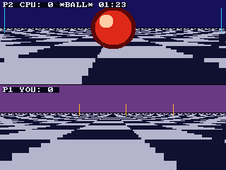

### Ace Pilot

3D wireframe dogfighting over an airfield to the Blue Danube, one player or two in split screen. D-pad flies, A fires, L/R throttle. L or R on the title picks 1 or 2 players.

Flight sim · `projects/ace_pilot` · from the Amiga version

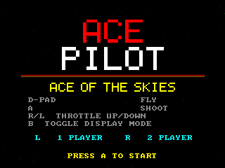 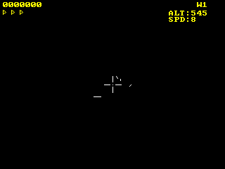

### Void Trader

Elite-style 3D space trading and combat with generated music. Fly, fight the pirates, dock at the station and trade. D-pad pitch/yaw, L/R roll, B/C thrust, A fire, P dock. Docked: UP/DOWN pick, B buy, C sell, P launch.

Space trade · `projects/void_trader` · from the Amiga version

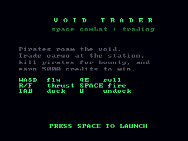 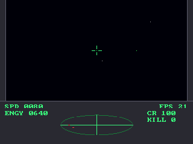

### RJ Birthday

Birthday party adventure with ProTracker music. Run around the party rooms, greet the guests, find the cake. D-pad moves, A acts, B help, C guest list, X back. Names: A adds a letter, UP/DOWN change it, B deletes, P confirms.

Adventure · `projects/rj_birthday` · from the Amiga version

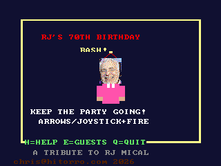 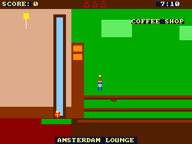

### Fractalus

Fly a fractal planet's valleys and rescue downed pilots - but some are Jaggis in disguise. Up/Down thrust and brake, Left/Right turn, L/R climb and dive, A fires, B lands, P starts.

3D flight · `projects/fractalus` · from the Amiga version

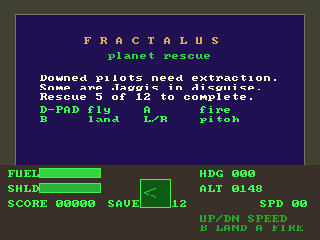 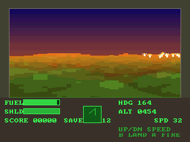

### Planet Chomp

A Pac-Man homage on a tiny planet: the maze wraps all the way round a sphere. Eat every crumb, dodge the four spooks, grab a golden key to eat them. D-pad steers (relative to the screen), L/R spin the view, C whole planet, P pause.

3D maze · `projects/planet_chomp` · from the Unity version

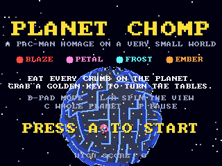 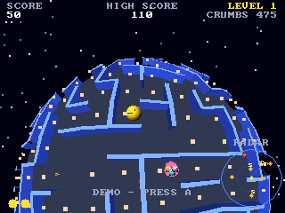
