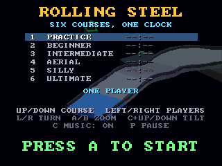

# Rolling Steel (3DO)

A 3DO version of [geekychris/rolling_steel](https://github.com/geekychris/rolling_steel),
an isometric roll-a-marble-downhill game in the spirit of the 1984 Atari cabinet,
originally a Unity (C#) game. Six descending courses, one shared clock, and a marble
that only moves because you pushed it. Unity does the work with its physics engine
and real-time 3D; neither exists on a 3DO, so both are rewritten here, and the courses
are built from the Unity game's own course files.




## Playing

| Pad | |
|---|---|
| D-pad | push the marble - relative to the view: up is away from you |
| L / R | turn the view: tap for a 45-degree step, hold to spin |
| A / B | zoom in / out |
| C + up/down | tilt the view |
| P | pause |
| X | back to the arcade menu |
| Title: up/down | the course to start from (course 1 is the full run) |
| Title: left/right | one player or two (the second on pad 2: split screen) |
| Title: C | music on / off |

The clock carries over from course to course; a fall costs 3 seconds and puts you
back on the course just behind where you last had contact. Gold, silver and bronze
times per course, best times and the best full run are kept in NVRAM, and your best
run on each course comes back as a ghost marble (this session). Left alone on the
title, the game plays itself, a course at a time.

## How it works

| File | |
|---|---|
| `courses/N.course` | the six courses, the Unity game's text files unchanged |
| `tools/courses.py` | `CourseScript.cs` + `CourseBuilder` + `LevelBuilder.cs` + `Decor.cs` in Python with Unity's quaternion maths: builds each course, then meshes it for the 3DO - faces as small quads lit like the Unity scene (key and fill light, trilight ambient, emission, linear colour) at six depth-fog levels, triangles for collision with friction/bounce classes, 2-unit and 8-unit grids, the route with its safe-respawn flags, triggers, obstacles, enemies and scenery. Buried end caps (pieces overlap their neighbours) are dropped |
| `src/phys.c` | the marble: a sphere with real spin against the course triangles (one-sided), Coulomb friction at the contact point and PhysX's rules (friction multiplied, bounce the larger, nothing under 2 m/s) - so it rolls on deck, slides on ice, bites on sand. Pillars, sweeper arms, crushers, crumbling tiles, fans, acid, steel chasers (mass 3) and blobs. Q12 fixed point at 50 Hz |
| `src/render.c` | the orthographic camera at any yaw, pitch and zoom: render cells near the view, faces facing away dropped by their normal, vertices projected once a frame (three dot products - no divides), a bucket sort by each face's farthest corner, flat cel quads. Round things are shaded sphere sprites; shadows and HUD boxes darken the frame buffer through the cel's pixel processor |
| `src/game.c` | `GameDirector.cs`, `Player.cs`, `IsoCamera.cs`, `Progress.cs`, `Ghost.cs`, `DeathFx.cs`: the clock, falls, respawn, medals, the camera's follow and orbit, wipeouts in slow motion, the autopilot (the Unity demo driver), one or two players |
| `src/main_3do.c` | main loop, HUD, best times in NVRAM; split screen through `gfx_set_underlay_split` (each view clipped to its half by the cel engine) |
| `tools/sounds.py` | `Music.cs` and `Sfx.cs`: the seven themes and the effects, rendered offline note for note (the Unity game synthesises them at startup); `src/sound.c` streams them on the DSP and pitches the rolling rumble with your speed |
| `tools/sim.c` | the physics on the host against the real courses: the autopilot must finish all six (part of `./3do test rolling_steel`) |

Speed: the game logic runs at 50 steps/s; drawing at about 16-30 frames/s depending
on how much of the course is in view.

Differences from the Unity game: no course editor (it needs a keyboard), ghosts last
the session rather than being saved, shadows are blobs under the marble rather than
the key light's, the wipeout's shards don't bounce, and the default view is a little
closer (the 3DO's 320 x 240 screen).

Rebuild the data after changing a course or the music:

```sh
python3 projects/rolling_steel/tools/courses.py
.venv/bin/python projects/rolling_steel/tools/sounds.py
```

The Unity game is MIT licensed (`LICENSE.original`).
