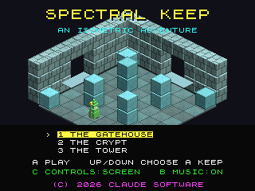

# Spectral Keep (3DO)

A 3DO version of [geekychris/spectral-keep](https://github.com/geekychris/spectral-keep),
an isometric flip-screen adventure in the style of Knight Lore and Head over
Heels, originally a Unity (C#) game. It's a rewrite, not a recompile (Unity
doesn't run on a 3DO): the rooms, physics, monsters, rules, music and sounds
follow the C# line by line, in C89 with fixed-point maths, and the 3D is
drawn the way the 8-bit originals did it, with pre-rendered sprites.

Three keeps, 24 rooms, taken unchanged from the Unity project's level files
(`levels/*.json` -> `src/levels.c` by `tools/levels2c.py`).




## Playing

| Pad | |
|---|---|
| D-pad | walk; directions are relative to the screen (C on the title switches to grid directions) |
| A or B | jump |
| P | pause |
| X | back to the arcade menu |
| Title: Up/Down, A | choose a keep, start |
| Title: B | music on / off |
| Title: L+R | a tour of every room of every keep |

Find the relics and carry them to the throne; keys open the red gates;
potions are extra lives; spikes, guards, hounds, ghosts and bouncers kill.

## How it works

| File | |
|---|---|
| `src/world.c` | `Physics.cs`: axis-separated box moves, gravity, pushing, lifts carrying riders. Q12 fixed point; the room's blocks are a grid, so a move only looks at the cells it sweeps |
| `src/room.c` | `RoomView.cs` and `Actors.cs`: building a room from its cells, doorways and NPC barriers, the player (coyote time, jump buffer), guard, hound, ghost, bouncer, sage, crates, lifts, pickups, gates, the throne |
| `src/game.c` | `Game.cs`: title, keeps, lives, keys, relics, messages, moving between rooms, death and respawn, the next keep, victory |
| `src/vox.c` | the models of `Models.cs` (boxes and spheres) drawn by a small z-buffered software rasteriser with the Unity scene's lighting and textures: every character in 8 facings and 3 walk frames at startup, each room's blocks, bricks and tiles when you enter it |
| `src/scene.c` | the room as cels: the floor and back walls as a per-room cel list, then blocks, props and characters back to front - a dependency sort over boxes ("behind" = further along +x or +z, or below) worked out once per room for the static pieces and per frame for the moving ones. Shadows and the status panel are cels whose pixel processor darkens the frame buffer |
| `src/sound.c` | music and effects on the Amiga layer's Paula (the DSP). A music loop is up to 460 KB, more than one Paula sample, so it plays as a chain of 128 KB blocks queued from a 50 Hz audio-time tick |
| `src/main_3do.c` | main loop, the status panel, title, game over and victory, in the game's own 8x8 font (`src/font.c`, from `ZxFont.cs`) |
| `tools/assets.py` | the music (`Music.cs`: the same seeded composer - with .NET's `System.Random`, so the melodies match - and synthesiser), the effects (`Beeper.cs`) and the surface textures, from the Unity project |
| `tools/sim.c` | the game logic compiled for the host and run against the real levels: lifts, crates, gates, the throne, monsters, spikes, game over (part of `./3do test spectral_keep`) |

The camera is Unity's orthographic Euler(30, 45) view snapped to whole
pixels (x: +14,-7; z: -14,-7; up: 17), so everything in a room is the same
image moved by whole pixels, which is what the cel engine is good at. The
game runs at 50 frames and 50 logic steps per second; entering a room takes
about 0.2 s (the Unity game fades for 0.22 s).

Differences from the Unity game:

- Only the modern style: the ZX Spectrum style (attribute clash shader,
  1-bit beeper music) and the level editor (it needs a keyboard) are not
  ported.
- Monsters are deadly to touch. In the Unity game a guard, hound or bouncer
  and the player block each other, so the hurt check (shrunk boxes) only
  ever fires for ghosts; here monsters and the player can overlap.
- The music is rendered offline (`tools/assets.py`) rather than at startup,
  at 11 kHz 8-bit, and doesn't crossfade between tracks.

Regenerate the data after changing the Unity project's levels or music:

```sh
python3 projects/spectral_keep/tools/levels2c.py
.venv/bin/python projects/spectral_keep/tools/assets.py <spectral-keep checkout>
```
